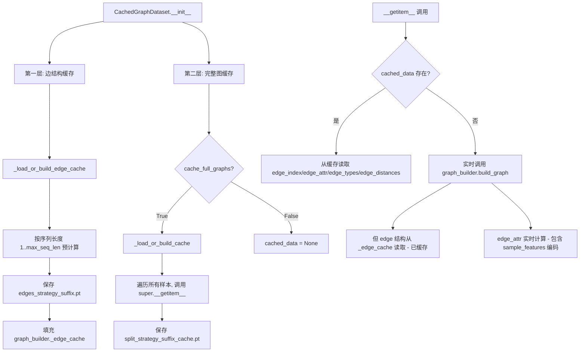
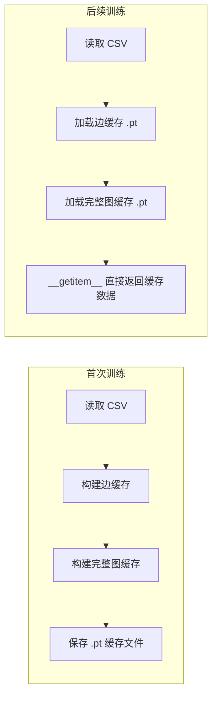

# 图数据预处理解耦与缓存策略优化方案

## 一、当前 CachedGraphDataset 缓存机制深度分析

### 1.1 两层缓存架构

`CachedGraphDataset` 实际上有两层缓存：



### 1.2 当前配置下的实际行为

查看 [`default.yaml`](graph_transform/config/default.yaml:95)：

```yaml
cache_graphs: true    # 启用 CachedGraphDataset
cache_dir: "cache/graph_data"
# 注意: 没有配置 cache_full_graphs
```

在 [`train_graph_model.py:416`](graph_transform/scripts/train_graph_model.py:416)：
```python
'cache_full_graphs': data_config.get('cache_full_graphs', False),
```

**结论：`cache_full_graphs` 默认为 `False`！**

这意味着当前配置下：
- ✅ **边结构已缓存**: `edge_index`, `edge_types`, `edge_distances` 按序列长度预计算并持久化
- ❌ **edge_attr 未缓存**: 每次调用 `__getitem__` 都会实时计算 `_create_edge_features`
- ❌ **CSV 每次重新读取**: 每次 `__init__` 都调用 `_load_data()` 读取 CSV

### 1.3 edge_attr 的计算开销分析

查看 [`_create_edge_features`](graph_transform/data/graph_builder.py:264)：

```python
def _create_edge_features(self, edge_types, edge_distances, sample_features):
    # 1. 基础特征: edge_types_f, edge_distances_f, inv_distance (来自已缓存的边结构)
    # 2. 环境特征: charge*0.1, pep_mass/2000, log1p(intensity)/20, nce*0.01, rt*0.01
    #    ↑ 这些值来自 CSV 的 sample_features，每个样本不同但固定
```

**关键发现**: `edge_attr` 由两部分组成：
1. **基础边特征**（3维）: 完全由边结构决定 → 已通过边缓存优化
2. **环境特征**（5维）: 由 `sample_features` 决定 → 每个样本不同但固定不变，**完全可以缓存**

### 1.4 每次训练启动的重复工作

即使有边缓存，每次训练启动时 `CachedGraphDataset.__init__` 仍然会：

1. **读取 CSV 文件** → `_load_data()` 重复 I/O
2. **初始化 GraphBuilder 和 Preprocessor** → 重复对象创建
3. **加载边缓存文件** → 重复 I/O（虽然比重新计算快）
4. **每个样本的 `__getitem__`** → 实时计算 `edge_attr`（矩阵运算 + 样本特征编码）

## 二、最小改动方案

### 2.1 核心思路

只需 **两处改动** 即可让 `CachedGraphDataset` 完全消除重复构图：

#### 改动 1: 在配置文件中启用 `cache_full_graphs`

**文件**: [`default.yaml`](graph_transform/config/default.yaml:95)

```yaml
data:
  cache_graphs: true
  cache_full_graphs: true   # 新增: 缓存完整图数据（含 edge_attr）
```

#### 改动 2: 修复缓存 key 的稳定性问题

**文件**: [`graph_dataset.py`](graph_transform/data/graph_dataset.py:522) 的 `_load_or_build_cache` 方法

当前问题：meta 中使用 `os.path.abspath(self.csv_path)` 作为 key，不同工作目录下绝对路径不同。

修复：使用 CSV 文件名 + 文件内容的哈希作为 key。

### 2.2 改动后的行为



### 2.3 仍然存在的重复工作（可接受）

即使启用了 `cache_full_graphs`，每次训练启动仍会：
1. 读取 CSV（用于获取 labels 和 sample_features）→ 但 `__getitem__` 中图数据直接从缓存读取
2. 加载缓存文件 → 一次性 I/O，不是瓶颈

这些是可接受的，因为：
- CSV 读取是必须的（labels 不能缓存，因为数据增强可能改变它们）
- 缓存加载是一次性的，比逐样本构图快几个数量级

## 三、具体实施步骤

### 步骤 1: 在 default.yaml 中增加 `cache_full_graphs: true`

**文件**: `graph_transform/config/default.yaml`

在 `data:` 部分增加一行配置。

### 步骤 2: 修复缓存 meta 中的路径稳定性问题

**文件**: `graph_transform/data/graph_dataset.py`

修改 `_load_or_build_cache` 方法中的 meta 字典：
- 将 `csv_path` 的绝对路径替换为文件名 + 文件修改时间 + 文件大小
- 这样即使工作目录变化，只要源数据不变，缓存就有效

### 步骤 3: 在 `__getitem__` 中跳过不必要的 CSV 字段读取（可选优化）

当 `cached_data` 存在时，`__getitem__` 仍然从 CSV row 中读取 `sample_features` 来构建 `state_vars` 和 `env_vars`。可以考虑将这些也缓存到 `cached_data` 中。

## 四、影响评估

| 改动 | 风险 | 收益 |
|------|------|------|
| 启用 cache_full_graphs | 极低（已有完整实现） | 消除每个 epoch 的 edge_attr 重复计算 |
| 修复缓存 key | 低（仅影响 meta 比较） | 缓存在不同目录下可复用 |
| 缓存 state_vars/env_vars | 低（少量额外内存） | 进一步减少 CSV 字段访问 |

### 内存/磁盘评估

- 当前边缓存文件大小：约几 MB（按序列长度 1-100 的所有边结构）
- 完整图缓存预估：每个样本约 1-5 KB（取决于序列长度），5000 样本约 5-25 MB
- 完全可接受
